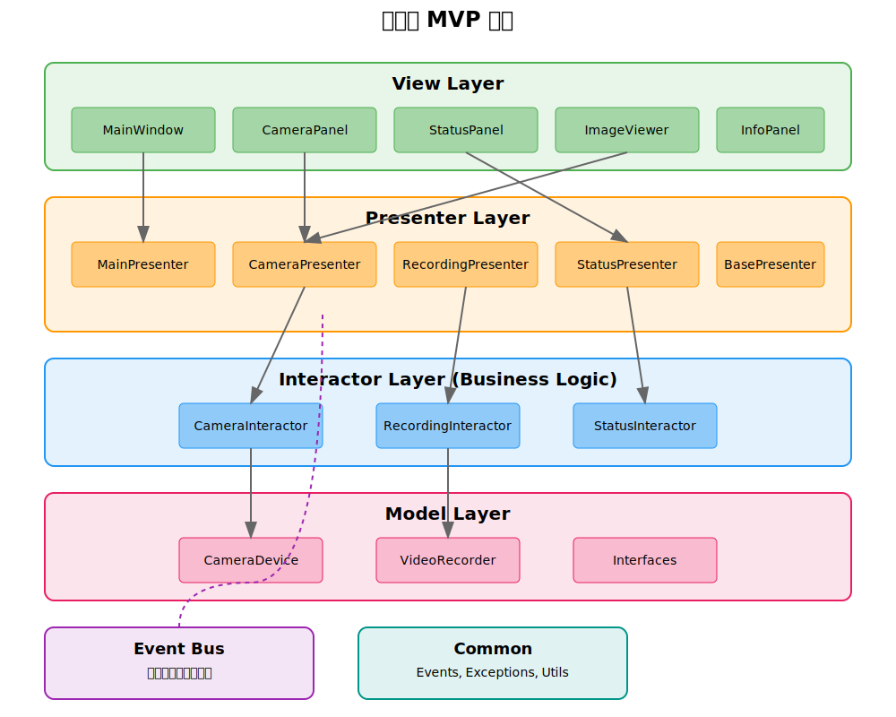

# Architecture Overview





## Project Structure
```
app/
├── model/
│   ├── __init__.py
│   ├── camera.py
│   └── interfaces/
│       ├── __init__.py
│       ├── camera_interface.py
│       └── recorder_interface.py
│
├── view/
│   ├── __init__.py
│   ├── main_window.py
│   ├── camera_panel_view.py
│   ├── camera_status_view.py
│   ├── info_entry_view.py
│   └── image_view.py
│
├── presenter/
│   ├── __init__.py
│   ├── base_presenter.py
│   ├── main_presenter.py
│   ├── camera_presenter.py
│   ├── recording_presenter.py
│   ├── status_presenter.py
│   └── interfaces/
│       ├── __init__.py
│       └── presenter_interface.py
│
├── interactor/
│   ├── __init__.py
│   ├── camera_interactor.py
│   ├── recording_interactor.py
│   └── status_interactor.py
│
├── common/
│   ├── __init__.py
│   ├── events.py
│   ├── event_bus.py
│   └── exceptions.py
│
└── main.py
```

